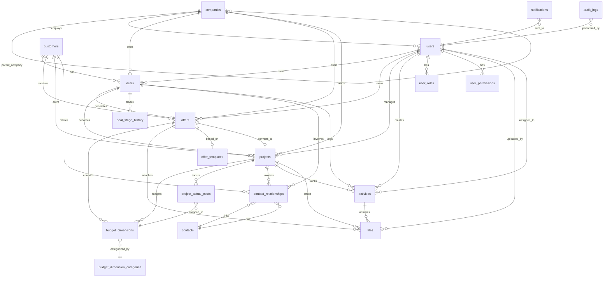
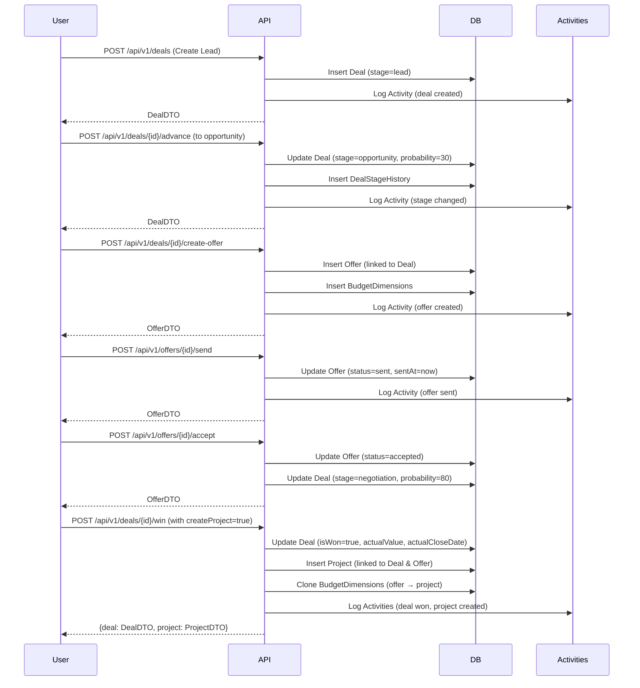
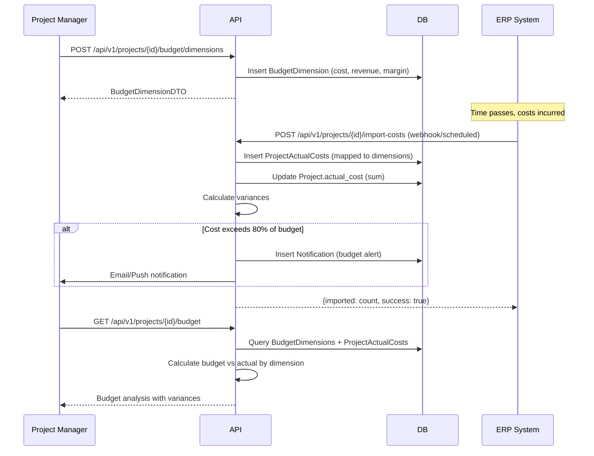
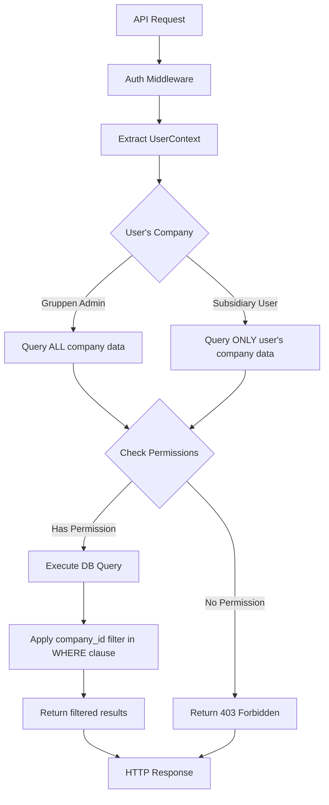

# Straye Relation API - Complete System Specification

**Version:** 2.0
**Date:** 2025-12-05
**Status:** Architecture Design

---

## Table of Contents

1. [Executive Summary](#executive-summary)
2. [System Architecture](#system-architecture)
3. [Database Schema](#database-schema)
4. [Entity-Relationship Diagram](#entity-relationship-diagram)
5. [REST API Endpoints](#rest-api-endpoints)
6. [Data Flow Diagrams](#data-flow-diagrams)
7. [Security & Permissions](#security--permissions)
8. [Migration Strategy](#migration-strategy)
9. [Implementation Guide](#implementation-guide)

---

## Executive Summary

The Straye Relation API is a comprehensive multi-tenant CRM/ERP system designed specifically for Straye Gruppen's construction business. The system manages 6 subsidiary companies (Gruppen, Stålbygg, Hybridbygg, Industri, Tak, Montasje) with complete sales lifecycle tracking, project management, financial budgeting, and customer relationship management.

### Key Features

- **Multi-Tenant Architecture**: Single database with company-based data isolation using RBAC
- **Sales Funnel Management**: Complete pipeline from Lead → Opportunity → Offer → Project
- **Flexible Budget Dimensions**: User-defined budget categories with manual margin override
- **Contact Relationship Management**: Polymorphic contacts with multiple relationship types
- **CRM Activities**: Meetings, tasks, calls, emails with file attachments
- **ERP Integration Ready**: Abstract interface for importing actual costs from external ERP systems
- **Dashboard Analytics**: Real-time KPIs via optimized database views
- **Comprehensive Audit Trail**: Complete activity logging and permission tracking
- **Microsoft Azure AD Authentication**: Secure JWT-based authentication

### Technology Stack

- **Language**: Go 1.21+
- **Framework**: Chi v5 (HTTP router)
- **ORM**: GORM
- **Database**: PostgreSQL 15+
- **Authentication**: Azure AD JWT + API Key
- **Documentation**: Swagger/OpenAPI 3.0

---

## System Architecture

### Clean Architecture Layers

```
┌─────────────────────────────────────────────────────────┐
│                   HTTP Layer (Chi Router)                │
│  ┌─────────────────────────────────────────────────┐   │
│  │           Handlers (Request/Response)            │   │
│  └─────────────────────────────────────────────────┘   │
└────────────────────┬────────────────────────────────────┘
                     │
┌────────────────────▼────────────────────────────────────┐
│                   Service Layer                          │
│  ┌─────────────────────────────────────────────────┐   │
│  │      Business Logic & Permission Checks          │   │
│  └─────────────────────────────────────────────────┘   │
└────────────────────┬────────────────────────────────────┘
                     │
┌────────────────────▼────────────────────────────────────┐
│                  Repository Layer                        │
│  ┌─────────────────────────────────────────────────┐   │
│  │    Data Access (GORM) + Company Filtering        │   │
│  └─────────────────────────────────────────────────┘   │
└────────────────────┬────────────────────────────────────┘
                     │
┌────────────────────▼────────────────────────────────────┐
│              PostgreSQL Database                         │
│  - Tables                                                │
│  - Views (KPIs)                                          │
│  - Triggers (Audit)                                      │
└──────────────────────────────────────────────────────────┘
```

### Multi-Tenant Data Isolation

```
User Request → Auth Middleware → Extract User Context
                                        ↓
                                  User's Company ID
                                        ↓
                     ┌──────────────────┴──────────────────┐
                     │                                       │
              Gruppen Admin                         Subsidiary User
                     │                                       │
        Set company_filter = "all"           Set company_filter = user.company_id
        (or specific company from query)                     │
                     │                                       │
                     └──────────────────┬──────────────────┘
                                        ↓
                          Repository Layer applies filter:
                          WHERE company_id = company_filter
```

---

## Database Schema

### Core Tables Overview

| Table | Purpose | Key Relationships |
|-------|---------|------------------|
| `companies` | Straye group companies | Parent-child hierarchy |
| `users` | System users | Belongs to company |
| `customers` | Client organizations | Shared across companies |
| `contacts` | Individual people | Many-to-many via relationships |
| `contact_relationships` | Contact associations | Polymorphic to customers/deals/projects |
| `deals` | Sales pipeline items | Belongs to customer, company, owner |
| `deal_stage_history` | Deal progression audit | Belongs to deal |
| `offers` | Sales proposals | Belongs to customer, deal |
| `offer_templates` | Reusable offer templates | Belongs to company |
| `budget_dimensions` | Budget line items | Polymorphic to offers/projects |
| `budget_dimension_categories` | Dimension types | Referenced by dimensions |
| `projects` | Active work | Belongs to customer, offer, deal |
| `project_actual_costs` | ERP-imported costs | Belongs to project, mapped to dimensions |
| `activities` | CRM interactions | Polymorphic to all entities |
| `files` | Document storage | Polymorphic to all entities |
| `user_roles` | Role assignments | User + Role + Company |
| `user_permissions` | Permission overrides | User + Resource + Action |
| `audit_logs` | System audit trail | All entity changes |
| `notifications` | User notifications | Belongs to user |

### Key Schema Details

#### Companies Table

```sql
CREATE TABLE companies (
    id VARCHAR(50) PRIMARY KEY,              -- 'gruppen', 'stalbygg', etc.
    name VARCHAR(200) NOT NULL,              -- 'Straye Gruppen'
    short_name VARCHAR(50) NOT NULL,         -- 'Gruppen'
    org_number VARCHAR(20) UNIQUE,
    is_parent BOOLEAN NOT NULL DEFAULT false,
    parent_company_id VARCHAR(50) REFERENCES companies(id),
    color VARCHAR(7),                        -- Hex color for UI
    created_at TIMESTAMP NOT NULL DEFAULT CURRENT_TIMESTAMP,
    updated_at TIMESTAMP NOT NULL DEFAULT CURRENT_TIMESTAMP
);
```

**Seed Data:**
- `gruppen` - Straye Gruppen (parent)
- `stalbygg` - Straye Stålbygg
- `hybridbygg` - Straye Hybridbygg
- `industri` - Straye Industri
- `tak` - Straye Tak
- `montasje` - Straye Montasje

#### Deals Table (Sales Funnel)

```sql
CREATE TYPE deal_stage AS ENUM (
    'lead',           -- Initial contact
    'qualified',      -- Qualified interest
    'opportunity',    -- Real opportunity
    'proposal',       -- Offer sent
    'negotiation',    -- Negotiating terms
    'won',            -- Deal won
    'lost'            -- Deal lost
);

CREATE TABLE deals (
    id UUID PRIMARY KEY DEFAULT gen_random_uuid(),
    name VARCHAR(200) NOT NULL,
    description TEXT,
    customer_id UUID NOT NULL REFERENCES customers(id),
    company_id VARCHAR(50) NOT NULL REFERENCES companies(id),
    owner_id UUID NOT NULL REFERENCES users(id),
    stage deal_stage NOT NULL DEFAULT 'lead',
    probability INT NOT NULL DEFAULT 0 CHECK (probability >= 0 AND probability <= 100),
    estimated_value DECIMAL(15,2) NOT NULL DEFAULT 0,
    weighted_value DECIMAL(15,2),             -- Auto: estimated_value * (probability/100)
    actual_value DECIMAL(15,2),               -- When won
    expected_close_date DATE,
    actual_close_date DATE,
    is_won BOOLEAN,
    is_lost BOOLEAN,
    loss_reason deal_loss_reason,
    offer_id UUID REFERENCES offers(id),      -- Link to offer when created
    project_id UUID REFERENCES projects(id),  -- Link to project when won
    created_at TIMESTAMP NOT NULL DEFAULT CURRENT_TIMESTAMP,
    updated_at TIMESTAMP NOT NULL DEFAULT CURRENT_TIMESTAMP,
    deleted_at TIMESTAMP
);
```

#### Contact Relationships (Polymorphic)

```sql
CREATE TYPE contact_type AS ENUM (
    'CUSTOMER',     -- Customer contact
    'SUPPLIER',     -- Supplier contact
    'PARTNER',      -- Partner contact
    'EMPLOYEE',     -- Internal employee
    'CONSULTANT'    -- External consultant
);

CREATE TABLE contact_relationships (
    id UUID PRIMARY KEY DEFAULT gen_random_uuid(),
    contact_id UUID NOT NULL REFERENCES contacts(id),
    entity_type VARCHAR(50) NOT NULL,  -- 'customer', 'deal', 'project', 'supplier'
    entity_id UUID NOT NULL,
    relationship_type contact_type NOT NULL,
    role VARCHAR(150),                 -- Specific role in this context
    is_primary BOOLEAN DEFAULT false,
    is_decision_maker BOOLEAN DEFAULT false,
    created_at TIMESTAMP NOT NULL DEFAULT CURRENT_TIMESTAMP
);
```

**Example:** John Doe can be:
- A CUSTOMER contact for "Acme Corp" (customer_id)
- A CUSTOMER technical contact for "Office Building Deal" (deal_id)
- A CONSULTANT on "Project PRJ-2024-001" (project_id)

#### Budget Dimensions (Flexible Budgeting)

```sql
CREATE TABLE budget_dimensions (
    id UUID PRIMARY KEY DEFAULT gen_random_uuid(),
    parent_type VARCHAR(50) NOT NULL,  -- 'offer' or 'project'
    parent_id UUID NOT NULL,
    category_id UUID REFERENCES budget_dimension_categories(id),
    custom_name VARCHAR(200),          -- If not using predefined category
    description TEXT,

    -- Financial
    cost DECIMAL(15,2) NOT NULL DEFAULT 0,
    revenue DECIMAL(15,2) NOT NULL DEFAULT 0,
    margin DECIMAL(15,2),              -- Auto: revenue - cost
    margin_percent DECIMAL(5,2),       -- Auto: (margin / revenue) * 100

    -- Manual margin override
    target_margin_percent DECIMAL(5,2),  -- User-set target
    is_margin_override BOOLEAN DEFAULT false,

    -- Tracking
    quantity DECIMAL(10,2),
    unit VARCHAR(50),
    sort_order INT DEFAULT 0,

    created_at TIMESTAMP NOT NULL DEFAULT CURRENT_TIMESTAMP
);

-- Trigger auto-calculates margin
-- If is_margin_override = true and target_margin_percent set:
--   revenue = cost / (1 - (target_margin_percent / 100))
-- margin = revenue - cost
-- margin_percent = (margin / revenue) * 100
```

**Predefined Categories:**
- Labor, Materials, Equipment, Subcontractors, Transportation, Permits, Insurance, Overhead, Contingency, Other

**Usage:**
- Offer: Add dimension "Labor: 500k cost, 700k revenue, 28.6% margin"
- Offer won → Project: Inherit dimensions, allow adjustments
- Project: Import actual costs from ERP, compare to budgeted dimensions

#### Project Actual Costs (ERP Integration)

```sql
CREATE TABLE project_actual_costs (
    id UUID PRIMARY KEY DEFAULT gen_random_uuid(),
    project_id UUID NOT NULL REFERENCES projects(id),
    budget_dimension_id UUID REFERENCES budget_dimensions(id),  -- Optional mapping
    description VARCHAR(500) NOT NULL,
    amount DECIMAL(15,2) NOT NULL,
    cost_type VARCHAR(100),                -- 'labor', 'material', etc.
    erp_system VARCHAR(50),                -- 'tripletex', 'visma', etc.
    erp_transaction_id VARCHAR(100),
    erp_invoice_number VARCHAR(100),
    transaction_date DATE NOT NULL,
    imported_at TIMESTAMP DEFAULT CURRENT_TIMESTAMP
);
```

**Integration Flow:**
1. ERP webhook pushes invoice data to API
2. API maps invoice to project and budget dimension
3. View `v_budget_vs_actual` calculates variance
4. If variance > threshold, create notification

### Database Views for KPIs

#### Sales Pipeline Summary

```sql
CREATE OR REPLACE VIEW v_sales_pipeline_summary AS
SELECT
    d.company_id,
    d.stage,
    COUNT(*) as deal_count,
    SUM(d.estimated_value) as total_value,
    SUM(d.weighted_value) as total_weighted_value,
    AVG(d.probability) as avg_probability
FROM deals d
WHERE d.deleted_at IS NULL
    AND d.is_won IS NULL
    AND d.is_lost IS NULL
GROUP BY d.company_id, d.stage;
```

#### Project Health Summary

```sql
CREATE OR REPLACE VIEW v_project_health_summary AS
SELECT
    p.company_id,
    p.status,
    p.health,
    COUNT(*) as project_count,
    SUM(p.budget_total) as total_budget,
    SUM(p.actual_cost) as total_actual_cost,
    AVG((p.actual_cost / NULLIF(p.budget_total, 0)) * 100) as avg_budget_used_percent
FROM projects p
WHERE p.deleted_at IS NULL
GROUP BY p.company_id, p.status, p.health;
```

#### Budget vs Actual by Dimension

```sql
CREATE OR REPLACE VIEW v_budget_vs_actual AS
SELECT
    p.id as project_id,
    p.project_number,
    p.company_id,
    bd.id as dimension_id,
    bdc.name as dimension_category,
    bd.cost as budgeted_cost,
    bd.revenue as budgeted_revenue,
    bd.margin as budgeted_margin,
    COALESCE(SUM(pac.amount), 0) as actual_cost,
    bd.revenue - COALESCE(SUM(pac.amount), 0) as actual_margin,
    bd.cost - COALESCE(SUM(pac.amount), 0) as cost_variance
FROM projects p
LEFT JOIN budget_dimensions bd ON bd.parent_type = 'project' AND bd.parent_id = p.id
LEFT JOIN budget_dimension_categories bdc ON bd.category_id = bdc.id
LEFT JOIN project_actual_costs pac ON pac.project_id = p.id AND pac.budget_dimension_id = bd.id
WHERE p.deleted_at IS NULL
GROUP BY p.id, bd.id, bdc.name;
```

---

## Entity-Relationship Diagram



---

## REST API Endpoints

**Base URL:** `https://api.straye.no/api/v1`

**Authentication:** All endpoints require JWT Bearer token or API Key unless marked `[Public]`

**Common Headers:**
- `Authorization: Bearer <jwt_token>` - Azure AD JWT
- `x-api-key: <api_key>` - API Key alternative

**Common Query Parameters:**
- `page` - Page number (default: 1)
- `pageSize` - Items per page (default: 20, max: 100)
- `sort` - Sort field and direction (e.g., `created_at_desc`)
- `company_id` - Filter by company (Gruppen users only)

### 1. Authentication Endpoints

#### Get Current User

```
GET /api/v1/auth/me
```

**Response 200 OK:**
```json
{
  "id": "uuid",
  "email": "user@straye.no",
  "displayName": "John Doe",
  "companyId": "stalbygg",
  "company": {
    "id": "stalbygg",
    "name": "Straye Stålbygg"
  },
  "roles": ["sales_user", "manager"],
  "permissions": [
    {"resource": "deal", "action": "create", "allowed": true},
    {"resource": "offer", "action": "delete", "allowed": false}
  ]
}
```

#### Get Current User Permissions

```
GET /api/v1/auth/permissions
```

**Response 200 OK:**
```json
{
  "permissions": [
    {"resource": "customer", "action": "create", "allowed": true},
    {"resource": "customer", "action": "read", "allowed": true},
    {"resource": "customer", "action": "update", "allowed": true},
    {"resource": "customer", "action": "delete", "allowed": false},
    {"resource": "deal", "action": "create", "allowed": true},
    // ... all permissions
  ]
}
```

---

### 2. Company Endpoints

#### List Companies

```
GET /api/v1/companies
```

**Auth:** None (public) or JWT for extended info

**Response 200 OK:**
```json
[
  {
    "id": "gruppen",
    "name": "Straye Gruppen",
    "shortName": "Gruppen",
    "color": "#1a1a1a",
    "isParent": true
  },
  {
    "id": "stalbygg",
    "name": "Straye Stålbygg",
    "shortName": "Stålbygg",
    "color": "#e74c3c",
    "isParent": false,
    "parentCompanyId": "gruppen"
  }
  // ... other companies
]
```

#### Get Company Details

```
GET /api/v1/companies/{id}
```

**Response 200 OK:**
```json
{
  "id": "stalbygg",
  "name": "Straye Stålbygg",
  "shortName": "Stålbygg",
  "orgNumber": "123456789",
  "email": "post@stralbygg.no",
  "phone": "+47 12345678",
  "address": "Stålveien 1",
  "city": "Oslo",
  "postalCode": "0123",
  "color": "#e74c3c",
  "isParent": false,
  "parentCompanyId": "gruppen",
  "stats": {
    "activeDeals": 42,
    "activeProjects": 15,
    "totalRevenue": 125000000,
    "teamSize": 35
  }
}
```

---

### 3. User Management Endpoints

#### List Users

```
GET /api/v1/users?company_id=stalbygg&role=sales_user&active=true&page=1&pageSize=20
```

**Auth:** JWT (all users can list users in their company)

**Response 200 OK:**
```json
{
  "data": [
    {
      "id": "uuid",
      "email": "john.doe@straye.no",
      "displayName": "John Doe",
      "firstName": "John",
      "lastName": "Doe",
      "jobTitle": "Sales Manager",
      "companyId": "stalbygg",
      "roles": ["sales_user", "manager"],
      "isActive": true,
      "lastLoginAt": "2024-12-05T10:30:00Z"
    }
  ],
  "pagination": {
    "page": 1,
    "pageSize": 20,
    "total": 35,
    "totalPages": 2
  }
}
```

#### Create User

```
POST /api/v1/users
```

**Auth:** JWT (system_admin or company_admin)

**Request Body:**
```json
{
  "email": "new.user@straye.no",
  "displayName": "New User",
  "firstName": "New",
  "lastName": "User",
  "companyId": "stalbygg",
  "jobTitle": "Sales Representative",
  "roles": ["sales_user"]
}
```

**Response 201 Created:**
```json
{
  "id": "uuid",
  "email": "new.user@straye.no",
  "displayName": "New User",
  "companyId": "stalbygg",
  "roles": ["sales_user"],
  "isActive": true,
  "createdAt": "2024-12-05T12:00:00Z"
}
```

---

### 4. Customer Endpoints

#### List Customers

```
GET /api/v1/customers?search=acme&status=active&page=1
```

**Query Parameters:**
- `search` - Search by name or org number
- `status` - Filter by status (active, inactive, prospect)
- `tier` - Filter by tier (bronze, silver, gold, platinum)
- `industry` - Filter by industry

**Response 200 OK:**
```json
{
  "data": [
    {
      "id": "uuid",
      "name": "Acme Construction AS",
      "orgNumber": "987654321",
      "email": "contact@acme.no",
      "phone": "+47 98765432",
      "address": "Byggeveien 10",
      "city": "Bergen",
      "postalCode": "5000",
      "customerStatus": "active",
      "customerTier": "gold",
      "industry": "Construction",
      "primaryCompanyId": "stalbygg",
      "stats": {
        "activeDeals": 3,
        "wonDeals": 12,
        "activeProjects": 2,
        "lifetimeValue": 15000000
      }
    }
  ],
  "pagination": {...}
}
```

#### Create Customer

```
POST /api/v1/customers
```

**Request Body:**
```json
{
  "name": "New Customer AS",
  "orgNumber": "123456789",
  "email": "post@newcustomer.no",
  "phone": "+47 12345678",
  "address": "Kundeveien 5",
  "city": "Oslo",
  "postalCode": "0456",
  "industry": "Construction",
  "customerTier": "silver",
  "primaryCompanyId": "stalbygg"
}
```

**Response 201 Created:** (CustomerDTO)

#### Get Customer

```
GET /api/v1/customers/{id}
```

**Response 200 OK:**
```json
{
  "id": "uuid",
  "name": "Acme Construction AS",
  // ... all customer fields ...
  "contacts": [
    {
      "id": "uuid",
      "firstName": "Jane",
      "lastName": "Smith",
      "email": "jane@acme.no",
      "jobTitle": "Project Manager",
      "isPrimary": true
    }
  ],
  "activeDeals": [
    {"id": "uuid", "name": "Office Building Project", "stage": "opportunity"}
  ],
  "activeProjects": [
    {"id": "uuid", "projectNumber": "PRJ-2024-001", "name": "Warehouse Construction"}
  ],
  "lifetimeValue": 15000000,
  "totalProjects": 14,
  "lastActivity": "2024-12-04T15:30:00Z"
}
```

---

### 5. Contact Endpoints

#### List Contacts

```
GET /api/v1/contacts?search=john&type=CUSTOMER&page=1
```

**Response 200 OK:**
```json
{
  "data": [
    {
      "id": "uuid",
      "firstName": "John",
      "lastName": "Doe",
      "email": "john.doe@customer.no",
      "phone": "+47 12345678",
      "jobTitle": "CEO",
      "isActive": true,
      "relationships": [
        {
          "id": "uuid",
          "entityType": "customer",
          "entityId": "uuid",
          "relationshipType": "CUSTOMER",
          "role": "Decision Maker",
          "isPrimary": true
        },
        {
          "id": "uuid",
          "entityType": "deal",
          "entityId": "uuid",
          "relationshipType": "CUSTOMER",
          "role": "Technical Contact"
        }
      ]
    }
  ],
  "pagination": {...}
}
```

#### Create Contact

```
POST /api/v1/contacts
```

**Request Body:**
```json
{
  "firstName": "Jane",
  "lastName": "Smith",
  "email": "jane.smith@company.no",
  "phone": "+47 98765432",
  "mobile": "+47 98765433",
  "jobTitle": "Project Manager",
  "department": "Operations"
}
```

**Response 201 Created:** (ContactDTO)

#### Add Contact Relationship

```
POST /api/v1/contacts/{id}/relationships
```

**Request Body:**
```json
{
  "entityType": "customer",
  "entityId": "uuid",
  "relationshipType": "CUSTOMER",
  "role": "Decision Maker",
  "isPrimary": true,
  "isDecisionMaker": true
}
```

**Response 201 Created:**
```json
{
  "id": "uuid",
  "contactId": "uuid",
  "entityType": "customer",
  "entityId": "uuid",
  "relationshipType": "CUSTOMER",
  "role": "Decision Maker",
  "isPrimary": true,
  "createdAt": "2024-12-05T12:00:00Z"
}
```

---

### 6. Deal (Sales Funnel) Endpoints

#### List Deals

```
GET /api/v1/deals?company_id=stalbygg&stage=opportunity&owner_id={userId}&page=1
```

**Query Parameters:**
- `company_id` - Filter by company
- `stage` - Filter by stage (lead, qualified, opportunity, proposal, negotiation, won, lost)
- `owner_id` - Filter by owner
- `customer_id` - Filter by customer
- `expected_close_from` - Date filter (YYYY-MM-DD)
- `expected_close_to` - Date filter (YYYY-MM-DD)
- `min_value` - Minimum estimated value
- `max_value` - Maximum estimated value
- `sort` - Sort by (weighted_value_desc, expected_close_date_asc, etc.)

**Response 200 OK:**
```json
{
  "data": [
    {
      "id": "uuid",
      "name": "Office Building Renovation",
      "description": "Complete renovation of office building",
      "customer": {
        "id": "uuid",
        "name": "Acme Construction AS"
      },
      "companyId": "stalbygg",
      "owner": {
        "id": "uuid",
        "displayName": "John Doe"
      },
      "stage": "opportunity",
      "probability": 60,
      "estimatedValue": 5000000,
      "weightedValue": 3000000,
      "expectedCloseDate": "2025-03-15",
      "priority": "high",
      "leadSource": "referral",
      "offerId": null,
      "projectId": null,
      "createdAt": "2024-11-01T10:00:00Z",
      "updatedAt": "2024-12-05T15:30:00Z"
    }
  ],
  "pagination": {...}
}
```

#### Create Deal

```
POST /api/v1/deals
```

**Request Body:**
```json
{
  "name": "New Construction Project",
  "description": "New commercial building construction",
  "customerId": "uuid",
  "companyId": "stalbygg",
  "ownerId": "uuid",
  "stage": "lead",
  "probability": 20,
  "estimatedValue": 10000000,
  "expectedCloseDate": "2025-06-30",
  "priority": "high",
  "leadSource": "website"
}
```

**Response 201 Created:** (DealDTO)

#### Get Deal

```
GET /api/v1/deals/{id}
```

**Response 200 OK:**
```json
{
  "id": "uuid",
  "name": "Office Building Renovation",
  "description": "Complete renovation",
  "customer": {...},
  "company": {...},
  "owner": {...},
  "stage": "opportunity",
  "probability": 60,
  "estimatedValue": 5000000,
  "weightedValue": 3000000,
  "expectedCloseDate": "2025-03-15",
  "offer": {
    "id": "uuid",
    "offerNumber": "OFF-2024-00123",
    "status": "sent"
  },
  "activities": [
    {
      "id": "uuid",
      "type": "meeting",
      "subject": "Initial meeting",
      "scheduledAt": "2024-11-15T14:00:00Z"
    }
  ],
  "stageHistory": [
    {
      "fromStage": "lead",
      "toStage": "qualified",
      "changedAt": "2024-11-10T12:00:00Z",
      "changedBy": {...}
    }
  ],
  "createdAt": "2024-11-01T10:00:00Z",
  "updatedAt": "2024-12-05T15:30:00Z"
}
```

#### Advance Deal Stage

```
POST /api/v1/deals/{id}/advance
```

**Request Body:**
```json
{
  "toStage": "opportunity",
  "probability": 60,
  "notes": "Customer confirmed budget, moving to opportunity"
}
```

**Response 200 OK:** (Updated DealDTO)

**Side Effects:**
- Creates `DealStageHistory` entry
- Logs activity
- Sends notification to owner

#### Win Deal

```
POST /api/v1/deals/{id}/win
```

**Request Body:**
```json
{
  "actualValue": 4800000,
  "actualCloseDate": "2024-12-05",
  "notes": "Contract signed",
  "createProject": true
}
```

**Response 200 OK:**
```json
{
  "deal": {
    "id": "uuid",
    "stage": "won",
    "isWon": true,
    "actualValue": 4800000,
    "actualCloseDate": "2024-12-05"
  },
  "project": {
    "id": "uuid",
    "projectNumber": "PRJ-2024-00456",
    "name": "Office Building Renovation",
    "customerId": "uuid",
    "dealId": "uuid",
    "offerId": "uuid",
    "status": "planning"
  }
}
```

**Side Effects:**
- Sets `is_won = true`, `actual_value`, `actual_close_date`
- If `createProject = true`, creates Project entity
- Inherits budget dimensions from linked Offer
- Creates activity log
- Sends notifications to stakeholders

#### Lose Deal

```
POST /api/v1/deals/{id}/lose
```

**Request Body:**
```json
{
  "lossReason": "price",
  "notes": "Lost to competitor on price"
}
```

**Response 200 OK:** (Updated DealDTO with `isLost = true`)

#### Create Offer from Deal

```
POST /api/v1/deals/{id}/create-offer
```

**Request Body:**
```json
{
  "title": "Office Building Renovation - Offer",
  "templateId": "uuid",  // Optional
  "validFrom": "2024-12-06",
  "validUntil": "2025-01-06"
}
```

**Response 201 Created:**
```json
{
  "id": "uuid",
  "offerNumber": "OFF-2024-00124",
  "title": "Office Building Renovation - Offer",
  "dealId": "uuid",
  "customerId": "uuid",
  "companyId": "stalbygg",
  "status": "draft",
  "validFrom": "2024-12-06",
  "validUntil": "2025-01-06"
}
```

**Side Effects:**
- Creates Offer entity linked to Deal
- Updates `deal.offer_id`
- If `templateId` provided, copies template dimensions
- Advances deal to "proposal" stage

---

### 7. Offer Endpoints

#### List Offers

```
GET /api/v1/offers?company_id=stalbygg&status=sent&customer_id={uuid}&page=1
```

**Response 200 OK:**
```json
{
  "data": [
    {
      "id": "uuid",
      "offerNumber": "OFF-2024-00123",
      "title": "Warehouse Construction",
      "customer": {...},
      "companyId": "stalbygg",
      "dealId": "uuid",
      "owner": {...},
      "status": "sent",
      "totalCost": 3500000,
      "totalRevenue": 5000000,
      "totalMargin": 1500000,
      "marginPercent": 30,
      "validFrom": "2024-11-01",
      "validUntil": "2024-12-01",
      "sentAt": "2024-11-05T10:00:00Z",
      "createdAt": "2024-11-01T09:00:00Z"
    }
  ],
  "pagination": {...}
}
```

#### Create Offer

```
POST /api/v1/offers
```

**Request Body:**
```json
{
  "title": "New Office Building Construction",
  "customerId": "uuid",
  "companyId": "stalbygg",
  "dealId": "uuid",
  "templateId": "uuid",  // Optional
  "ownerId": "uuid",
  "validFrom": "2024-12-06",
  "validUntil": "2025-01-06",
  "paymentTerms": "Net 30 days",
  "deliveryTerms": "FOB site",
  "warrantyTerms": "5 years structural warranty"
}
```

**Response 201 Created:** (OfferDTO)

#### Get Offer

```
GET /api/v1/offers/{id}
```

**Response 200 OK:**
```json
{
  "id": "uuid",
  "offerNumber": "OFF-2024-00123",
  "title": "Warehouse Construction",
  "customer": {...},
  "deal": {...},
  "owner": {...},
  "status": "sent",
  "version": 1,
  "totalCost": 3500000,
  "totalRevenue": 5000000,
  "totalMargin": 1500000,
  "marginPercent": 30,
  "budgetDimensions": [
    {
      "id": "uuid",
      "category": {
        "id": "uuid",
        "name": "Labor"
      },
      "description": "Construction labor",
      "cost": 1000000,
      "revenue": 1400000,
      "margin": 400000,
      "marginPercent": 28.57,
      "quantity": 5000,
      "unit": "hours"
    },
    {
      "id": "uuid",
      "category": {
        "id": "uuid",
        "name": "Materials"
      },
      "description": "Building materials",
      "cost": 2000000,
      "revenue": 3000000,
      "margin": 1000000,
      "marginPercent": 33.33,
      "targetMarginPercent": 35,
      "isMarginOverride": true
    }
  ],
  "files": [
    {"id": "uuid", "filename": "floor_plan.pdf", "category": "drawing"}
  ],
  "validFrom": "2024-11-01",
  "validUntil": "2024-12-01",
  "sentAt": "2024-11-05T10:00:00Z",
  "viewedAt": "2024-11-06T08:30:00Z"
}
```

#### Send Offer

```
POST /api/v1/offers/{id}/send
```

**Request Body:**
```json
{
  "recipientEmails": ["contact@customer.no"],
  "message": "Please review our proposal for the warehouse construction project."
}
```

**Response 200 OK:** (Updated OfferDTO with `sentAt` timestamp)

**Side Effects:**
- Sets `status = 'sent'`, `sentAt = now()`
- Sends email to recipients (future implementation)
- Creates activity log
- If linked to Deal, advances deal stage to "proposal"

#### Accept Offer

```
POST /api/v1/offers/{id}/accept
```

**Request Body:**
```json
{
  "acceptedBy": "Customer contact name",
  "notes": "Contract signed via DocuSign",
  "createProject": true
}
```

**Response 200 OK:**
```json
{
  "offer": {
    "id": "uuid",
    "status": "accepted",
    "acceptedAt": "2024-12-05T14:00:00Z"
  },
  "project": {
    "id": "uuid",
    "projectNumber": "PRJ-2024-00456",
    "name": "Warehouse Construction",
    "status": "planning"
  }
}
```

**Side Effects:**
- Sets `status = 'accepted'`, `acceptedAt = now()`
- If linked to Deal, advances deal to "negotiation" stage
- If `createProject = true`, creates Project with inherited budget
- Creates activity log

#### Get Offer Budget

```
GET /api/v1/offers/{id}/budget
```

**Response 200 OK:**
```json
{
  "dimensions": [
    {
      "id": "uuid",
      "category": {"id": "uuid", "name": "Labor"},
      "cost": 1000000,
      "revenue": 1400000,
      "margin": 400000,
      "marginPercent": 28.57
    },
    // ... other dimensions
  ],
  "summary": {
    "totalCost": 3500000,
    "totalRevenue": 5000000,
    "totalMargin": 1500000,
    "marginPercent": 30,
    "dimensionCount": 5
  }
}
```

#### Add Budget Dimension

```
POST /api/v1/offers/{id}/budget/dimensions
```

**Request Body:**
```json
{
  "categoryId": "uuid",           // Use predefined category
  "customName": null,             // Or custom name if categoryId is null
  "description": "Construction labor for phase 1",
  "cost": 1000000,
  "revenue": 1400000,
  "targetMarginPercent": null,    // Optional: Set target margin
  "isMarginOverride": false,
  "quantity": 5000,
  "unit": "hours"
}
```

**OR with manual margin:**
```json
{
  "categoryId": "uuid",
  "description": "Materials",
  "cost": 2000000,
  "targetMarginPercent": 35,      // Set target margin %
  "isMarginOverride": true,       // Enable override
  "revenue": null                 // Will be auto-calculated: 2000000 / (1 - 0.35) = 3076923
}
```

**Response 201 Created:**
```json
{
  "id": "uuid",
  "category": {"id": "uuid", "name": "Labor"},
  "description": "Construction labor for phase 1",
  "cost": 1000000,
  "revenue": 1400000,
  "margin": 400000,
  "marginPercent": 28.57,
  "quantity": 5000,
  "unit": "hours",
  "sortOrder": 0
}
```

**Calculation Logic:**
```
IF is_margin_override AND target_margin_percent IS NOT NULL:
    revenue = cost / (1 - (target_margin_percent / 100))
ELSE:
    revenue = (user-provided revenue)

margin = revenue - cost
margin_percent = (margin / revenue) * 100
```

#### Clone Offer

```
POST /api/v1/offers/{id}/clone
```

**Request Body:**
```json
{
  "newTitle": "Warehouse Construction - Revised",
  "customerId": "uuid",
  "includeDimensions": true
}
```

**Response 201 Created:** (New OfferDTO with cloned dimensions)

---

### 8. Offer Template Endpoints

#### List Offer Templates

```
GET /api/v1/offer-templates?company_id=stalbygg&active=true
```

**Response 200 OK:**
```json
[
  {
    "id": "uuid",
    "name": "Standard Warehouse Construction",
    "description": "Template for typical warehouse projects",
    "companyId": "stalbygg",
    "isActive": true,
    "useCount": 15,
    "defaultDimensions": [
      {"category": "Labor", "defaultCost": 1000000, "targetMargin": 30},
      {"category": "Materials", "defaultCost": 2000000, "targetMargin": 35}
    ],
    "createdAt": "2024-01-15T10:00:00Z"
  }
]
```

#### Create Template

```
POST /api/v1/offer-templates
```

**Auth:** JWT (manager or company_admin)

**Request Body:**
```json
{
  "name": "Office Renovation Template",
  "description": "Standard template for office renovations",
  "companyId": "stalbygg",
  "titleTemplate": "{{customer_name}} - Office Renovation",
  "defaultPaymentTerms": "Net 30 days",
  "defaultDeliveryTerms": "FOB site",
  "defaultWarrantyTerms": "2 years"
}
```

**Response 201 Created:** (OfferTemplateDTO)

---

### 9. Project Endpoints

#### List Projects

```
GET /api/v1/projects?company_id=stalbygg&status=active&health=at_risk&page=1
```

**Query Parameters:**
- `company_id` - Filter by company
- `status` - Filter by status (planning, active, on_hold, completed, cancelled)
- `health` - Filter by health (on_track, at_risk, delayed, over_budget)
- `manager_id` - Filter by project manager
- `customer_id` - Filter by customer

**Response 200 OK:**
```json
{
  "data": [
    {
      "id": "uuid",
      "projectNumber": "PRJ-2024-00456",
      "name": "Warehouse Construction",
      "customer": {...},
      "companyId": "stalbygg",
      "manager": {...},
      "status": "active",
      "health": "on_track",
      "completionPercent": 45,
      "startDate": "2024-06-01",
      "endDate": "2025-03-31",
      "budgetTotal": 5000000,
      "actualCost": 2100000,
      "invoicedAmount": 2250000,
      "budgetUsedPercent": 42,
      "createdAt": "2024-05-15T10:00:00Z"
    }
  ],
  "pagination": {...}
}
```

#### Create Project

```
POST /api/v1/projects
```

**Request Body:**
```json
{
  "name": "New Commercial Building",
  "summary": "5-story commercial office building",
  "customerId": "uuid",
  "companyId": "stalbygg",
  "managerId": "uuid",
  "dealId": "uuid",
  "offerId": "uuid",
  "startDate": "2025-01-15",
  "endDate": "2025-12-31",
  "budgetTotal": 25000000,
  "hasDetailedBudget": true,  // Will use budget_dimensions
  "siteAddress": "Kontorvegen 10",
  "siteCity": "Oslo",
  "sitePostalCode": "0456",
  "teamMembers": ["uuid1", "uuid2", "uuid3"]
}
```

**Response 201 Created:** (ProjectDTO)

#### Get Project

```
GET /api/v1/projects/{id}
```

**Response 200 OK:**
```json
{
  "id": "uuid",
  "projectNumber": "PRJ-2024-00456",
  "name": "Warehouse Construction",
  "summary": "Complete warehouse construction",
  "customer": {...},
  "company": {...},
  "manager": {...},
  "teamMembers": [
    {"id": "uuid", "displayName": "John Doe", "role": "Lead Architect"}
  ],
  "deal": {...},
  "offer": {...},
  "status": "active",
  "health": "on_track",
  "completionPercent": 45,
  "startDate": "2024-06-01",
  "endDate": "2025-03-31",
  "estimatedCompletionDate": "2025-03-15",
  "budgetTotal": 5000000,
  "actualCost": 2100000,
  "invoicedAmount": 2250000,
  "hasDetailedBudget": true,
  "budgetSummary": {
    "totalBudget": 5000000,
    "totalActual": 2100000,
    "totalRemaining": 2900000,
    "budgetUsedPercent": 42,
    "projectedOverrun": 0
  },
  "siteAddress": "Lagerveien 5",
  "siteCity": "Bergen",
  "teamsChannelUrl": "https://teams.microsoft.com/...",
  "createdAt": "2024-05-15T10:00:00Z",
  "updatedAt": "2024-12-05T16:00:00Z"
}
```

#### Inherit Budget from Offer

```
POST /api/v1/projects/{id}/inherit-budget
```

**Request Body:**
```json
{
  "offerId": "uuid",
  "allowAdjustments": true
}
```

**Response 200 OK:** (Updated ProjectDTO with budget dimensions)

**Side Effects:**
- Copies all budget dimensions from Offer to Project
- Sets `parent_type = 'project'`, `parent_id = project.id`
- If `allowAdjustments = false`, locks dimensions (future enhancement)

#### Get Project Budget Analysis

```
GET /api/v1/projects/{id}/budget
```

**Response 200 OK:**
```json
{
  "dimensions": [
    {
      "id": "uuid",
      "category": {"id": "uuid", "name": "Labor"},
      "description": "Construction labor",
      "budgetedCost": 1000000,
      "budgetedRevenue": 1400000,
      "budgetedMargin": 400000,
      "budgetedMarginPercent": 28.57,
      "actualCost": 450000,
      "actualMargin": 950000,
      "actualMarginPercent": 67.86,
      "costVariance": 550000,
      "costVariancePercent": -55,
      "status": "under_budget"
    },
    // ... other dimensions
  ],
  "summary": {
    "totalBudgetCost": 3500000,
    "totalBudgetRevenue": 5000000,
    "totalBudgetMargin": 1500000,
    "totalActualCost": 2100000,
    "totalRemainingBudget": 1400000,
    "budgetUsedPercent": 60,
    "projectedFinalCost": 3300000,
    "projectedOverrun": -200000
  },
  "alerts": [
    {
      "dimensionId": "uuid",
      "category": "Materials",
      "type": "approaching_budget",
      "message": "Materials costs at 85% of budget",
      "severity": "warning"
    }
  ]
}
```

#### Get Actual Costs

```
GET /api/v1/projects/{id}/actual-costs?from_date=2024-01-01&to_date=2024-12-31&dimension_id={uuid}
```

**Response 200 OK:**
```json
{
  "data": [
    {
      "id": "uuid",
      "projectId": "uuid",
      "budgetDimension": {
        "id": "uuid",
        "category": "Labor"
      },
      "description": "Construction labor - November",
      "amount": 150000,
      "costType": "labor",
      "erpSystem": "tripletex",
      "erpTransactionId": "INV-12345",
      "erpInvoiceNumber": "2024-11-001",
      "supplierName": "Labor AS",
      "transactionDate": "2024-11-30",
      "importedAt": "2024-12-01T08:00:00Z"
    }
  ],
  "pagination": {...},
  "summary": {
    "total": 2100000,
    "byCategory": [
      {"category": "Labor", "total": 450000},
      {"category": "Materials", "total": 1500000},
      {"category": "Equipment", "total": 150000}
    ]
  }
}
```

#### Import Actual Costs (ERP Integration)

```
POST /api/v1/projects/{id}/import-costs
```

**Auth:** JWT (manager or admin)

**Request Body:**
```json
{
  "erpSystem": "tripletex",
  "fromDate": "2024-11-01",
  "toDate": "2024-11-30",
  "costs": [
    {
      "description": "Construction labor - November",
      "amount": 150000,
      "date": "2024-11-30",
      "reference": "INV-12345",
      "invoiceNumber": "2024-11-001",
      "supplier": "Labor AS",
      "costType": "labor",
      "budgetDimensionId": "uuid"  // Optional mapping
    },
    // ... more costs
  ]
}
```

**Response 200 OK:**
```json
{
  "imported": 15,
  "failed": 0,
  "totalAmount": 2100000,
  "errors": []
}
```

**Side Effects:**
- Creates `project_actual_costs` entries
- Updates `project.actual_cost`
- Recalculates budget health
- If variance > threshold, creates notification

#### Update Project Status

```
PUT /api/v1/projects/{id}/status
```

**Request Body:**
```json
{
  "status": "active",
  "health": "at_risk",
  "completionPercent": 55,
  "notes": "Delayed due to weather, adjusting timeline"
}
```

**Response 200 OK:** (Updated ProjectDTO)

---

### 10. Activity Endpoints

#### List Activities

```
GET /api/v1/activities?entity_type=deal&entity_id={uuid}&type=meeting&status=planned&page=1
```

**Query Parameters:**
- `entity_type` - Filter by entity type (customer, deal, offer, project)
- `entity_id` - Filter by entity ID
- `type` - Filter by type (meeting, call, email, task, note, system)
- `status` - Filter by status (planned, in_progress, completed, cancelled)
- `assigned_to` - Filter by assigned user ('me' for current user)
- `owner_id` - Filter by owner
- `due_from` / `due_to` - Date range filter
- `sort` - Sort by (due_date_asc, scheduled_at_desc, etc.)

**Response 200 OK:**
```json
{
  "data": [
    {
      "id": "uuid",
      "type": "meeting",
      "status": "completed",
      "subject": "Project kickoff meeting",
      "description": "Initial project kickoff with customer",
      "outcome": "Agreed on project timeline and milestones",
      "entityType": "project",
      "entityId": "uuid",
      "owner": {...},
      "attendeeUsers": [
        {"id": "uuid", "displayName": "John Doe"}
      ],
      "attendeeContacts": [
        {"id": "uuid", "firstName": "Jane", "lastName": "Smith"}
      ],
      "scheduledAt": "2024-11-15T14:00:00Z",
      "completedAt": "2024-11-15T16:00:00Z",
      "durationMinutes": 120,
      "location": "Customer office",
      "isVirtual": false,
      "createdAt": "2024-11-10T09:00:00Z"
    },
    {
      "id": "uuid",
      "type": "task",
      "status": "planned",
      "subject": "Review contract terms",
      "dueDate": "2024-12-10",
      "assignedTo": {...},
      "isHighPriority": true,
      "entityType": "deal",
      "entityId": "uuid"
    }
  ],
  "pagination": {...}
}
```

#### Create Activity

```
POST /api/v1/activities
```

**Request Body (Meeting):**
```json
{
  "type": "meeting",
  "subject": "Project status meeting",
  "description": "Weekly project status update",
  "entityType": "project",
  "entityId": "uuid",
  "scheduledAt": "2024-12-10T10:00:00Z",
  "durationMinutes": 60,
  "location": "Conference Room A",
  "isVirtual": false,
  "attendeeUserIds": ["uuid1", "uuid2"],
  "attendeeContactIds": ["uuid3"]
}
```

**Request Body (Task):**
```json
{
  "type": "task",
  "subject": "Review budget report",
  "description": "Review Q4 budget report and prepare comments",
  "entityType": "project",
  "entityId": "uuid",
  "dueDate": "2024-12-15",
  "assignedTo": "uuid",
  "isHighPriority": true,
  "reminderAt": "2024-12-14T09:00:00Z"
}
```

**Response 201 Created:** (ActivityDTO)

**Side Effects:**
- If task assigned, creates notification for assigned user
- If meeting, sends calendar invitation (future enhancement)

#### Get My Tasks

```
GET /api/v1/activities/my-tasks?status=planned&due_today=true
```

**Response 200 OK:**
```json
[
  {
    "id": "uuid",
    "type": "task",
    "status": "planned",
    "subject": "Review contract terms",
    "dueDate": "2024-12-05",
    "isHighPriority": true,
    "entityType": "deal",
    "entityId": "uuid",
    "entity": {
      "type": "deal",
      "id": "uuid",
      "name": "Office Building Project"
    },
    "isOverdue": false,
    "daysUntilDue": 0
  }
]
```

#### Get Upcoming Activities

```
GET /api/v1/activities/upcoming?days=7&type=meeting
```

**Response 200 OK:**
```json
[
  {
    "id": "uuid",
    "type": "meeting",
    "subject": "Client presentation",
    "scheduledAt": "2024-12-08T14:00:00Z",
    "durationMinutes": 90,
    "location": "Teams",
    "isVirtual": true,
    "meetingUrl": "https://teams.microsoft.com/...",
    "entityType": "deal",
    "entityId": "uuid"
  }
]
```

#### Complete Activity

```
POST /api/v1/activities/{id}/complete
```

**Request Body:**
```json
{
  "outcome": "Agreed on next steps, customer will provide site access",
  "completedAt": "2024-12-05T15:30:00Z",
  "followUpRequired": true,
  "followUpDate": "2024-12-12"
}
```

**Response 200 OK:** (Updated ActivityDTO with `status = 'completed'`)

**Side Effects:**
- Sets `completedAt`
- If `followUpRequired`, creates new task with `parent_activity_id`

---

### 11. File Endpoints

#### Upload File

```
POST /api/v1/files/upload
```

**Auth:** JWT

**Headers:**
- `Content-Type: multipart/form-data`

**Form Data:**
- `file` - File binary
- `entityType` - Entity type (offer, project, customer, deal, activity)
- `entityId` - Entity UUID
- `category` - File category (contract, drawing, photo, document, other)
- `description` - File description (optional)

**Response 201 Created:**
```json
{
  "id": "uuid",
  "filename": "floor_plan_v2.pdf",
  "originalFilename": "Floor Plan Version 2.pdf",
  "contentType": "application/pdf",
  "sizeBytes": 2457600,
  "storagePath": "files/2024/12/uuid/floor_plan_v2.pdf",
  "entityType": "project",
  "entityId": "uuid",
  "category": "drawing",
  "uploadedBy": {...},
  "uploadedAt": "2024-12-05T16:00:00Z"
}
```

#### Download File

```
GET /api/v1/files/{id}/download
```

**Response 200 OK:**
- Content-Type: (file's content type)
- Content-Disposition: attachment; filename="floor_plan_v2.pdf"
- Body: File binary stream

**Side Effects:**
- Increments `download_count`

#### List Files

```
GET /api/v1/files?entity_type=project&entity_id={uuid}&category=drawing&page=1
```

**Response 200 OK:**
```json
{
  "data": [
    {
      "id": "uuid",
      "filename": "floor_plan_v2.pdf",
      "contentType": "application/pdf",
      "sizeBytes": 2457600,
      "category": "drawing",
      "description": "Updated floor plan with client revisions",
      "uploadedBy": {...},
      "uploadedAt": "2024-12-05T16:00:00Z",
      "downloadCount": 5
    }
  ],
  "pagination": {...}
}
```

---

### 12. Dashboard & Analytics Endpoints

#### Get Dashboard Metrics

```
GET /api/v1/dashboard/metrics?company_id=stalbygg&from_date=2024-01-01&to_date=2024-12-31
```

**Auth:** JWT

**Response 200 OK:**
```json
{
  "salesPipeline": {
    "byStage": [
      {"stage": "lead", "count": 15, "totalValue": 25000000, "weightedValue": 5000000},
      {"stage": "opportunity", "count": 8, "totalValue": 40000000, "weightedValue": 24000000},
      {"stage": "proposal", "count": 5, "totalValue": 30000000, "weightedValue": 24000000},
      {"stage": "negotiation", "count": 3, "totalValue": 20000000, "weightedValue": 18000000}
    ],
    "totalDeals": 31,
    "totalValue": 115000000,
    "totalWeightedValue": 71000000,
    "avgProbability": 62,
    "conversionRate": 35,
    "winRate": 68
  },
  "projects": {
    "byStatus": [
      {"status": "planning", "count": 2, "totalBudget": 15000000},
      {"status": "active", "count": 12, "totalBudget": 150000000, "totalActual": 85000000},
      {"status": "completed", "count": 8, "totalBudget": 95000000, "totalActual": 92000000}
    ],
    "byHealth": [
      {"health": "on_track", "count": 10},
      {"health": "at_risk", "count": 2},
      {"health": "delayed", "count": 0},
      {"health": "over_budget", "count": 0}
    ],
    "totalActive": 12,
    "totalCompleted": 8,
    "avgCompletionPercent": 63
  },
  "customers": {
    "total": 156,
    "new": 8,
    "topByRevenue": [
      {"customer": {...}, "lifetimeValue": 35000000, "dealCount": 12},
      {"customer": {...}, "lifetimeValue": 28000000, "dealCount": 9}
    ]
  },
  "activities": {
    "myTasks": [
      {"id": "uuid", "subject": "Review contract", "dueDate": "2024-12-06", "isHighPriority": true}
    ],
    "upcomingMeetings": [
      {"id": "uuid", "subject": "Client presentation", "scheduledAt": "2024-12-08T14:00:00Z"}
    ],
    "overdueTasksCount": 2
  },
  "team": {
    "topPerformers": [
      {
        "user": {...},
        "dealsOwned": 15,
        "dealsWon": 10,
        "winRate": 67,
        "totalValue": 45000000
      }
    ]
  }
}
```

#### Get Sales Pipeline

```
GET /api/v1/dashboard/sales-pipeline?company_id=stalbygg&user_id={uuid}&from=2024-01-01
```

**Response 200 OK:**
```json
{
  "byStage": [
    {
      "stage": "opportunity",
      "deals": [
        {"id": "uuid", "name": "Office Building", "estimatedValue": 5000000, "probability": 60}
      ],
      "count": 8,
      "totalValue": 40000000,
      "weightedValue": 24000000
    }
  ],
  "forecast30Days": 18000000,
  "forecast90Days": 52000000,
  "conversionRates": {
    "leadToOpportunity": 45,
    "opportunityToWon": 60
  }
}
```

#### Get Project Health

```
GET /api/v1/dashboard/project-health?company_id=stalbygg&status=active
```

**Response 200 OK:**
```json
{
  "projects": [
    {
      "id": "uuid",
      "projectNumber": "PRJ-2024-00456",
      "name": "Warehouse Construction",
      "status": "active",
      "health": "on_track",
      "budgetTotal": 5000000,
      "actualCost": 2100000,
      "budgetUsedPercent": 42,
      "completionPercent": 45,
      "variance": 150000,
      "projectedOverrun": 0
    }
  ],
  "summary": {
    "totalOnTrack": 10,
    "totalAtRisk": 2,
    "totalDelayed": 0,
    "totalOverBudget": 0
  },
  "alerts": [
    {
      "projectId": "uuid",
      "projectName": "Office Renovation",
      "type": "budget_approaching",
      "message": "Project at 85% of budget with 60% completion",
      "severity": "warning"
    }
  ]
}
```

#### Get Customer Insights

```
GET /api/v1/dashboard/customer-insights?company_id=stalbygg
```

**Response 200 OK:**
```json
{
  "topCustomers": [
    {
      "customer": {...},
      "lifetimeValue": 35000000,
      "dealCount": 12,
      "projectCount": 10,
      "lastActivity": "2024-12-03T10:00:00Z"
    }
  ],
  "customerDistribution": {
    "byTier": {
      "platinum": 5,
      "gold": 12,
      "silver": 28,
      "bronze": 111
    },
    "byIndustry": {
      "construction": 85,
      "manufacturing": 42,
      "logistics": 29
    },
    "byStatus": {
      "active": 140,
      "inactive": 12,
      "prospect": 4
    }
  },
  "newCustomersThisMonth": 3,
  "churnedCustomersThisMonth": 0
}
```

---

### 13. Search Endpoints

#### Global Search

```
GET /api/v1/search?q=acme&types=customer,deal,project&limit=50
```

**Response 200 OK:**
```json
{
  "customers": [
    {"id": "uuid", "name": "Acme Construction AS", "orgNumber": "987654321", "type": "customer"}
  ],
  "deals": [
    {"id": "uuid", "name": "Acme Office Building", "stage": "opportunity", "type": "deal"}
  ],
  "projects": [
    {"id": "uuid", "projectNumber": "PRJ-2024-00123", "name": "Acme Warehouse", "type": "project"}
  ],
  "contacts": [
    {"id": "uuid", "firstName": "John", "lastName": "Acme", "email": "john@acme.no", "type": "contact"}
  ],
  "offers": [],
  "total": 4
}
```

#### Autocomplete Search

```
GET /api/v1/search/autocomplete?q=ac&type=customer&limit=10
```

**Response 200 OK:**
```json
[
  {
    "id": "uuid",
    "type": "customer",
    "label": "Acme Construction AS",
    "subtitle": "987654321 - Oslo"
  },
  {
    "id": "uuid",
    "type": "customer",
    "label": "Active Building AS",
    "subtitle": "123456789 - Bergen"
  }
]
```

---

### 14. Notification Endpoints

#### List Notifications

```
GET /api/v1/notifications?unread=true&type=task_assigned&page=1
```

**Response 200 OK:**
```json
{
  "data": [
    {
      "id": "uuid",
      "type": "task_assigned",
      "title": "New task assigned",
      "message": "John Doe assigned you the task 'Review contract terms'",
      "entityType": "activity",
      "entityId": "uuid",
      "actionUrl": "/activities/uuid",
      "actionLabel": "View Task",
      "isRead": false,
      "createdAt": "2024-12-05T10:00:00Z"
    }
  ],
  "pagination": {...},
  "unreadCount": 5
}
```

#### Mark as Read

```
PUT /api/v1/notifications/{id}/read
```

**Response 200 OK:** (Updated NotificationDTO with `isRead = true`)

#### Mark All as Read

```
PUT /api/v1/notifications/read-all
```

**Response 200 OK:**
```json
{
  "readCount": 5
}
```

---

## Data Flow Diagrams

### Deal → Offer → Project Workflow



### Budget vs Actual Cost Tracking



### Multi-Company Data Isolation Flow



---

## Security & Permissions

### Role-Based Access Control (RBAC)

#### Fixed Roles

| Role | Description | Scope |
|------|-------------|-------|
| `system_admin` | Full system access | All companies |
| `company_admin` | Company administrator | Single company (or all if Gruppen) |
| `manager` | Department manager | Single company |
| `sales_user` | Sales representative | Single company |
| `viewer` | Read-only access | Single company |

#### Permission Matrix

| Resource | System Admin | Company Admin | Manager | Sales User | Viewer |
|----------|--------------|---------------|---------|------------|--------|
| Users (own company) | CRUD | CRUD | R | R | R |
| Users (other companies) | CRUD | - | - | - | - |
| Customers | CRUD | CRUD | CRUD | CRU | R |
| Contacts | CRUD | CRUD | CRUD | CRU | R |
| Deals (own) | CRUD | CRUD | CRUD | CRUD | R |
| Deals (team) | CRUD | CRUD | CRUD | R | R |
| Offers (own) | CRUD | CRUD | CRUD | CRUD | R |
| Offers (team) | CRUD | CRUD | CRUD | R | R |
| Projects (as manager) | CRUD | CRUD | CRUD | RU | R |
| Projects (team member) | CRUD | CRUD | RU | RU | R |
| Budget Dimensions | CRUD | CRUD | CRUD | R | R |
| Actual Costs | CRUD | CRUD | CRU | R | R |
| Activities | CRUD | CRUD | CRUD | CRU | R |
| Files | CRUD | CRUD | CRUD | CRU | R |
| Reports | All | Company | Team | Own | Own |

**Legend:**
- C = Create
- R = Read
- U = Update
- D = Delete

### Data Isolation Rules

#### Gruppen (Parent Company)

- Users from "gruppen" company see all data across all subsidiaries
- Can filter by specific company using `?company_id=stalbygg`
- Dashboards show aggregated metrics across all companies by default

#### Subsidiary Companies

- Users from subsidiaries (stalbygg, hybridbygg, etc.) see ONLY their company's data
- Cannot access other subsidiaries' deals, offers, or projects
- Shared entities (customers, contacts) visible to all companies

### Permission Checking Flow

```go
// Pseudo-code for permission checking
func (s *Service) CheckPermission(ctx context.Context, resource, action string, resourceOwnerId uuid.UUID) bool {
    userCtx := auth.FromContext(ctx)

    // 1. Check if user has role that grants permission
    if userCtx.HasRole("system_admin") {
        return true
    }

    if userCtx.HasRole("company_admin") && userCtx.CompanyID == resourceCompanyId {
        return true
    }

    if resource == "deal" && action == "update" {
        if userCtx.HasRole("manager") && userCtx.CompanyID == resourceCompanyId {
            return true
        }
        if userCtx.HasRole("sales_user") && resourceOwnerId == userCtx.UserID {
            return true
        }
    }

    // 2. Check custom permission overrides
    permission := s.permissionRepo.GetPermission(userCtx.UserID, resource, action, resourceCompanyId)
    if permission != nil && permission.IsAllowed {
        return true
    }

    return false
}
```

---

## Migration Strategy

### Migration Phases

#### Phase 1: Companies & Users (Week 1)

**Files:**
- `migrations/00002_add_companies_and_enhanced_users.sql`

**Changes:**
- Create `companies` table with 6 Straye companies
- Add `company_id`, `azure_ad_oid`, `first_name`, `last_name` to `users` table
- Set existing users' `company_id = 'gruppen'`

**Rollback Plan:**
- Keep `users_backup` table for 2 weeks
- Rollback removes new columns, restores from backup

#### Phase 2: Deals & Contacts (Week 2)

**Files:**
- `migrations/00003_add_deals_and_contacts.sql`

**Changes:**
- Create `deals`, `deal_stage_history` tables
- Rebuild `contacts` and `contact_relationships` tables
- Migrate existing contacts to new structure

**Data Migration:**
```sql
-- Migrate existing contacts
INSERT INTO contacts (id, first_name, last_name, email, phone, created_at, updated_at)
SELECT
    id,
    SPLIT_PART(name, ' ', 1),
    SUBSTRING(name FROM POSITION(' ' IN name) + 1),
    email,
    phone,
    created_at,
    updated_at
FROM contacts_old;

-- Create relationships for customer associations
INSERT INTO contact_relationships (contact_id, entity_type, entity_id, relationship_type, is_primary)
SELECT
    c.id,
    'customer',
    c.customer_id,
    'CUSTOMER',
    true
FROM contacts_old c
WHERE c.customer_id IS NOT NULL;
```

#### Phase 3: Budget Dimensions (Week 3)

**Files:**
- `migrations/00004_add_budget_dimensions.sql`

**Changes:**
- Create `budget_dimension_categories` with seed data
- Create `budget_dimensions` table with trigger for margin calculation
- Migrate existing `offer_items` to `budget_dimensions`

**Data Migration:**
```sql
-- Migrate offer_items to budget_dimensions
INSERT INTO budget_dimensions (
    parent_type, parent_id, custom_name, description,
    cost, revenue, quantity, unit, created_at
)
SELECT
    'offer',
    offer_id,
    discipline,
    description,
    cost,
    revenue,
    quantity,
    unit,
    created_at
FROM offer_items;
```

#### Phase 4: Projects & Actual Costs (Week 4)

**Files:**
- `migrations/00005_add_project_enhancements.sql`

**Changes:**
- Add `deal_id`, `offer_id`, `has_detailed_budget` to `projects` table
- Create `project_actual_costs` table

#### Phase 5: Activities & Permissions (Week 5)

**Files:**
- `migrations/00006_add_enhanced_activities_and_permissions.sql`

**Changes:**
- Rebuild `activities` table with new types and status
- Create `user_roles`, `user_permissions` tables
- Create `audit_logs` table
- Migrate existing activities

#### Phase 6: Database Views (Week 6)

**Files:**
- `migrations/00007_create_kpi_views.sql`

**Changes:**
- Create all KPI views for dashboard

### Deployment Checklist

- [ ] Backup production database (full snapshot)
- [ ] Run migration 00002 (companies & users)
- [ ] Verify company data isolation works
- [ ] Run migration 00003 (deals & contacts)
- [ ] Verify contact relationships
- [ ] Run migration 00004 (budget dimensions)
- [ ] Verify margin calculations
- [ ] Run migration 00005 (project enhancements)
- [ ] Run migration 00006 (activities & permissions)
- [ ] Run migration 00007 (views)
- [ ] Deploy new API code
- [ ] Smoke test all endpoints
- [ ] Monitor error logs for 48 hours
- [ ] Remove old backup tables after 2 weeks

---

## Implementation Guide

### Go Domain Models

**New/Updated Models:**

```go
// internal/domain/models.go

type Company struct {
    BaseModel
    ID              string    `gorm:"type:varchar(50);primary_key"`
    Name            string    `gorm:"type:varchar(200);not null"`
    ShortName       string    `gorm:"type:varchar(50);not null"`
    OrgNumber       string    `gorm:"type:varchar(20);unique"`
    IsParent        bool      `gorm:"not null;default:false"`
    ParentCompanyID *string   `gorm:"type:varchar(50)"`
    Color           string    `gorm:"type:varchar(7)"`
}

type Deal struct {
    BaseModel
    Name              string          `gorm:"type:varchar(200);not null"`
    CustomerID        uuid.UUID       `gorm:"type:uuid;not null"`
    Customer          *Customer       `gorm:"foreignKey:CustomerID"`
    CompanyID         string          `gorm:"type:varchar(50);not null"`
    OwnerID           uuid.UUID       `gorm:"type:uuid;not null"`
    Owner             *User           `gorm:"foreignKey:OwnerID"`
    Stage             string          `gorm:"type:varchar(50);not null"`
    Probability       int             `gorm:"not null;default:0"`
    EstimatedValue    float64         `gorm:"type:decimal(15,2);not null"`
    WeightedValue     float64         `gorm:"type:decimal(15,2)"`
    IsWon             *bool
    IsLost            *bool
    DeletedAt         *time.Time      `gorm:"index"`
}

type BudgetDimension struct {
    BaseModel
    ParentType           string              `gorm:"type:varchar(50);not null"`
    ParentID             uuid.UUID           `gorm:"type:uuid;not null"`
    CategoryID           *uuid.UUID          `gorm:"type:uuid"`
    Cost                 float64             `gorm:"type:decimal(15,2);not null"`
    Revenue              float64             `gorm:"type:decimal(15,2);not null"`
    Margin               float64             `gorm:"type:decimal(15,2)"`
    MarginPercent        float64             `gorm:"type:decimal(5,2)"`
    TargetMarginPercent  *float64            `gorm:"type:decimal(5,2)"`
    IsMarginOverride     bool                `gorm:"default:false"`
}
```

### Repository Pattern

```go
// internal/repository/deal_repository.go

type DealRepository struct {
    db *gorm.DB
}

func (r *DealRepository) List(ctx context.Context, filters DealFilters) ([]Deal, int64, error) {
    var deals []Deal
    var total int64

    query := r.db.WithContext(ctx).Model(&Deal{})

    // Apply company filter from context
    if companyFilter, ok := ctx.Value("company_filter").(string); ok && companyFilter != "all" {
        query = query.Where("company_id = ?", companyFilter)
    }

    // Apply other filters
    if filters.Stage != "" {
        query = query.Where("stage = ?", filters.Stage)
    }

    // Soft delete
    query = query.Where("deleted_at IS NULL")

    // Count
    if err := query.Count(&total).Error; err != nil {
        return nil, 0, err
    }

    // Paginate
    err := query.
        Offset((filters.Page - 1) * filters.PageSize).
        Limit(filters.PageSize).
        Preload("Customer").
        Preload("Owner").
        Find(&deals).Error

    return deals, total, err
}
```

### Service Pattern

```go
// internal/service/deal_service.go

func (s *DealService) Win(ctx context.Context, id uuid.UUID, req *WinDealRequest) (*WinDealResponse, error) {
    userCtx := auth.MustFromContext(ctx)

    // Permission check
    if !s.hasWinPermission(ctx, userCtx, id) {
        return nil, ErrPermissionDenied
    }

    // Start transaction
    tx := s.db.Begin()
    defer tx.Rollback()

    // Update deal
    deal, err := s.dealRepo.GetByIDWithTx(ctx, tx, id)
    if err != nil {
        return nil, err
    }

    deal.IsWon = &true
    deal.ActualValue = &req.ActualValue
    deal.ActualCloseDate = &req.ActualCloseDate

    if err := s.dealRepo.UpdateWithTx(ctx, tx, deal); err != nil {
        return nil, err
    }

    // Create project if requested
    var project *Project
    if req.CreateProject {
        project, err = s.createProjectFromDeal(ctx, tx, deal)
        if err != nil {
            return nil, err
        }

        // Inherit budget from offer
        if deal.OfferID != nil {
            s.budgetService.InheritFromOfferWithTx(ctx, tx, *deal.OfferID, project.ID)
        }
    }

    // Log activity
    s.activityRepo.CreateWithTx(ctx, tx, &Activity{
        Type:       ActivityTypeSystem,
        Subject:    "Deal won",
        EntityType: "deal",
        EntityID:   deal.ID,
        OwnerID:    userCtx.UserID,
    })

    // Audit log
    s.auditRepo.LogWithTx(ctx, tx, &AuditLog{
        EntityType: "deal",
        EntityID:   deal.ID,
        Action:     "win",
        UserID:     &userCtx.UserID,
    })

    // Commit
    if err := tx.Commit().Error; err != nil {
        return nil, err
    }

    return &WinDealResponse{
        Deal:    mapper.ToDealDTO(deal),
        Project: mapper.ToProjectDTO(project),
    }, nil
}
```

### Middleware Pattern

```go
// internal/auth/middleware.go

func (m *Middleware) CompanyFilter(next http.Handler) http.Handler {
    return http.HandlerFunc(func(w http.ResponseWriter, r *http.Request) {
        userCtx, _ := auth.FromContext(r.Context())

        // Gruppen users can filter by query param
        if userCtx.CompanyID == "gruppen" {
            requestedCompany := r.URL.Query().Get("company_id")
            if requestedCompany != "" {
                ctx := context.WithValue(r.Context(), "company_filter", requestedCompany)
                next.ServeHTTP(w, r.WithContext(ctx))
                return
            }
            // No filter = see all
            ctx := context.WithValue(r.Context(), "company_filter", "all")
            next.ServeHTTP(w, r.WithContext(ctx))
            return
        }

        // Subsidiary users only see their company
        ctx := context.WithValue(r.Context(), "company_filter", userCtx.CompanyID)
        next.ServeHTTP(w, r.WithContext(ctx))
    })
}
```

---

## Conclusion

This comprehensive specification provides a complete blueprint for transforming the Straye Relation API into a world-class multi-tenant CRM/ERP system. The architecture is designed for scalability, security, and maintainability while following clean architecture principles and Go best practices.

**Next Steps:**
1. Review and approve this specification
2. Begin Phase 1 implementation (database migrations)
3. Implement domain models and repositories
4. Build service layer with business logic
5. Create HTTP handlers and wire routes
6. Test thoroughly with integration tests
7. Deploy with careful migration strategy

**Contact:**
For questions or clarifications, please create an issue in the repository or contact the development team.

---

**Document Version:** 2.0
**Last Updated:** 2025-12-05
**Authors:** Claude Code (AI Architecture Agent)
**Status:** Draft for Review
